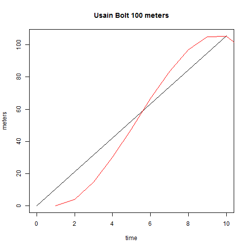
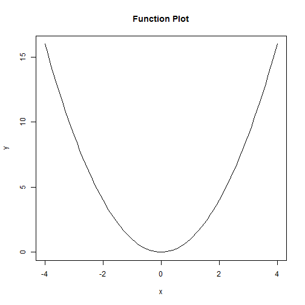

Calculus
========================================================
author: Rob Hayward
date:  

Usain Bolt
========================================================
This first section has been adapted from [Khan Academy](href{https://www.khanacademy.org/math/calculus/differential-calculus/intro_differential_calc/v/newton-leibniz-and-usain-bolt)

* Run 100 meters in 9.58 seconds

* It is not likely that the speed is constant 

* The slope of the line is 

$$\frac{\Delta y}{\Delta x} = \frac{distance}{time} = \frac{100}{9.58} = 10.43$$ 

Bolt
======================================================
 

*** 
* Slope is constant for average speed

* Slope changes for instantaneous speed
Derivative
 
* Need to find the tangent of the red line

Instantaneous Speed
========================================================
* $$\text{Average Speed} = 10.43\frac{m}{s}$$

* $$\text{Instantaneous Speed} = \frac{f(x_0 + h) - f(x_0)}{(x_0 +h) - x_0} = \frac{(y_1 + h) - y_0}{h}$$ 

* $$f'(x_0) = \lim_{h \to 0} \frac{f(x_0 +h) - f(x_0)}{h}$$

Example
========================================================

 

Example
===============================
* $$\text{Instantaneous Speed} = \frac{f(x_0 + h) - f(x_0)}{(x_0 +h) - x_0} = \frac{(y_1 + h) - y_0}{h}$$ 

When $f(x) = y = x^2$

* $$if h = 0.1, \frac{(y_1 + h) - y_0}{h} = 6.1$$

* $$if h = 0.01, \frac{(y_1 + h) - y_0}{h} = 6.01$$ 

* $$if h = 0.001, \frac{(y_1 + h) - y_0}{h} = 6.001$

Derivative
=======================================
* Derivative is
$$f'(x)$$ 
$$\frac{\mathrm d f}{\mathrm d x}(x_0)$$       
$$\frac{\mathrm d y}{\mathrm dx} (x_0);$$ 

Remember this!!!
==================================================

* For any positive integer k

* $$f(x) = y = x^k$$

* $$f'(x) = kx^{k-1}$$

Steps
=====================================
1.  Calculate the derivative of the function (see box bottom of page 3)

2.  Set derivative equal to zero (zero slope for maximum)

3.  Solve!  (Math or trial and error)

